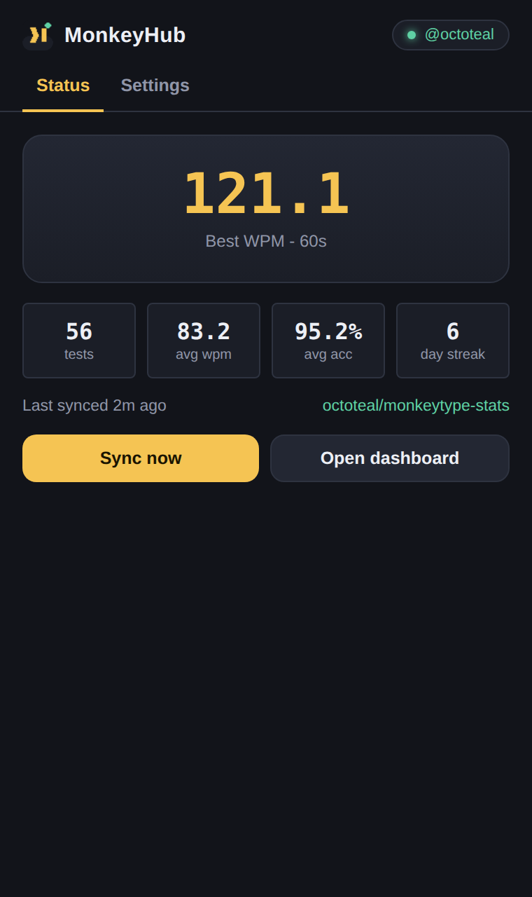
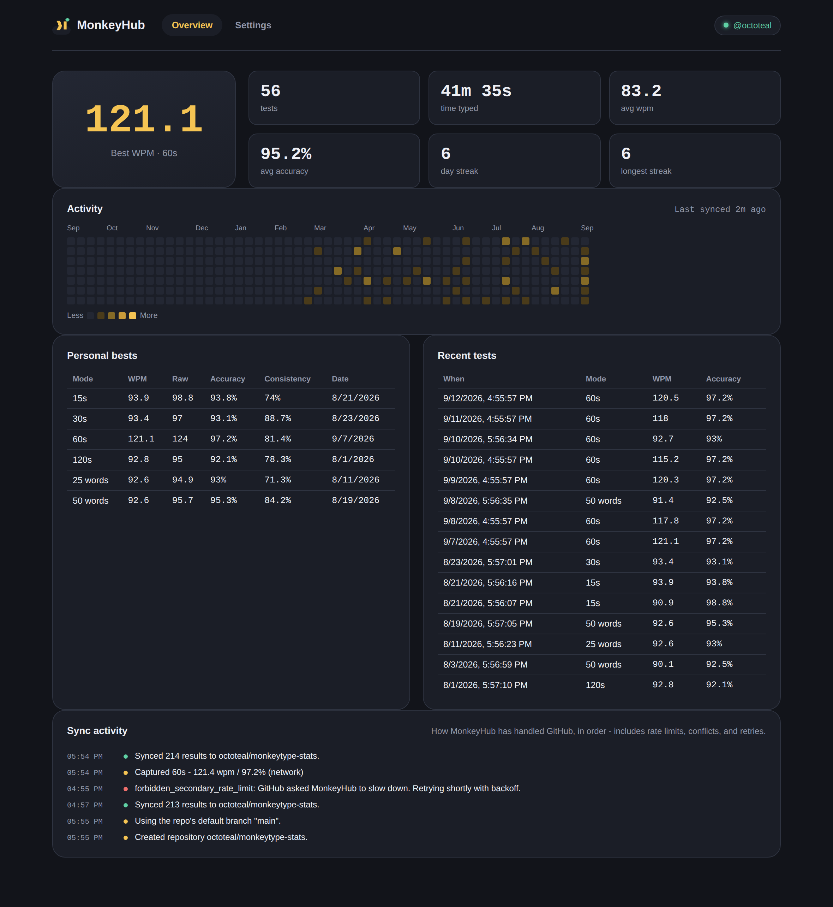
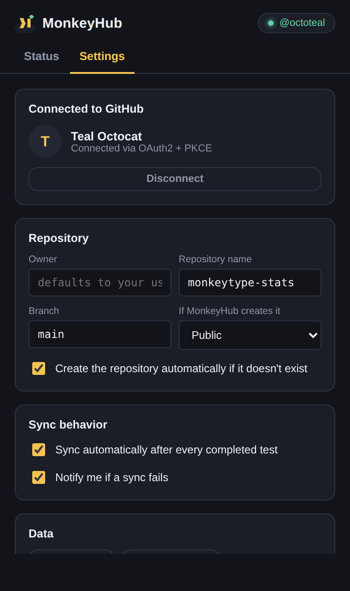
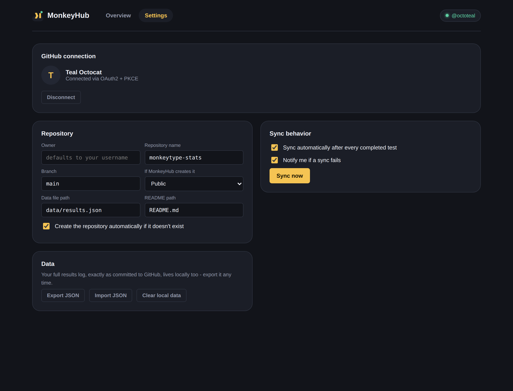

# MonkeyHub

**MonkeyHub** watches [monkeytype.com](https://monkeytype.com) in the background, and every time you finish a typing test it commits the result to a GitHub repository of your choice - keeping a live, profile-style `README.md` up to date with your personal bests, streaks, and an activity calendar, GitHub-contribution-graph style.

No dashboard to check, nothing to click after the first setup: finish a test, watch the commit land.

|                              |                              |
| ---------------------------- | ---------------------------- |
|  |  |
|  |  |

A real, generated example of the README MonkeyHub pushes to your repo lives at [`docs/sample-generated-README.md`](docs/sample-generated-README.md).

---

## Contents

- [What it does](#what-it-does)
- [How it works](#how-it-works)
- [Install the extension](#install-the-extension)
- [Connect GitHub](#connect-github)
- [Configuration reference](#configuration-reference)
- [Repository layout MonkeyHub creates](#repository-layout-monkeyhub-creates)
- [Edge cases & error handling](#edge-cases--error-handling)
- [Privacy & security](#privacy--security)
- [Troubleshooting](#troubleshooting)
- [Project structure](#project-structure)
- [License](#license)

---

## What it does

- **Captures every completed test automatically.** A content script watches monkeytype.com two ways at once: it sniffs the site's own network traffic for the result it saves to your account (when you're logged in), and it reads the on-screen results panel directly (works even logged out). Whichever arrives first wins; the other is discarded so you never get duplicates.
- **Commits to GitHub in real time.** No polling, no "sync every hour" - a completed test triggers a sync immediately.
- **Writes a profile-style README.** Overview stats, personal bests per mode (`time 15/30/60/120`, `words 10/25/50/100`, quote, zen, custom), a full year activity calendar, and your 10 most recent tests - regenerated on every sync.
- **Handles GitHub like a real client should.** Repo-doesn't-exist-yet, rate limits (primary and secondary), stale-file conflicts, oversized files, SSO-locked tokens, offline queues - see [Edge cases](#edge-cases--error-handling) for the full list and exactly what MonkeyHub does about each one.
- **Two ways to connect:** a proper OAuth2 + PKCE flow for real-time, no-token-copying sync, or a Personal Access Token if you'd rather skip standing up a proxy.
- **Works on Chrome and Firefox** from a single codebase (two thin manifests, everything else shared).

## How it works

```
monkeytype.com
   │
   │  content/page-bridge.js  (injected into the page, sniffs fetch/XHR)
   │  content/content.js      (isolated world, DOM fallback + message bridge)
   ▼
background.js  (MV3 service worker)
   │
   │  lib/stats.js            → personal bests, streaks, activity calendar
   │  lib/readme-generator.js → renders README.md
   │  lib/github-client.js    → GitHub REST calls, retries, error classification
   │  lib/oauth.js            → OAuth2 + PKCE flow via chrome.identity
   ▼
GitHub repository
   data/results.json   (append-only log, one entry per test)
   README.md           (regenerated every sync)
```

Nothing here talks to a MonkeyHub server, because there isn't one - the only two network destinations are `api.github.com` and (if you use OAuth) your own token-exchange proxy. See [Privacy & security](#privacy--security).

## Install the extension

This repo ships **source** (`src/`) plus a tiny build step that copies it into browser-specific bundles, because Chrome and Firefox still disagree on a couple of manifest keys (service worker vs. background scripts, mainly). You don't need Node or any dependencies to build it - it's a plain file copy.

```bash
./build.sh
```

This produces `dist/chrome/` and `dist/firefox/`, fully self-contained, ready to load. (Pre-built copies of both are also included if you'd rather skip this step.)

### Chrome, Edge, Brave, or any other Chromium browser

1. Go to `chrome://extensions`.
2. Turn on **Developer mode** (top-right toggle).
3. Click **Load unpacked** and select the `dist/chrome` folder.
4. Pin the MonkeyHub icon from the extensions toolbar menu if you'd like it visible at all times.

### Firefox

**Temporary (for trying it out):**
1. Go to `about:debugging#/runtime/this-firefox`.
2. Click **Load Temporary Add-on** and select `dist/firefox/manifest.json`.
3. Temporary add-ons are removed when Firefox restarts - reload it after each restart.

**Permanent:** Firefox requires add-ons distributed outside addons.mozilla.org to be signed. For personal use, package `dist/firefox` and self-distribute via [Firefox's unlisted signing process](https://extensionworkshop.com/documentation/publish/signing-and-distributing-your-add-on/), or run it as a temporary add-on each session.

## Connect GitHub

Open the extension popup → **Settings** (or the full dashboard via **Open dashboard**). Both work identically; the dashboard just has more room.

### Option A - Personal Access Token (fastest, ~30 seconds)

1. On GitHub: **Settings → Developer settings → Personal access tokens → Fine-grained tokens → Generate new token**.
2. Scope it to the repository MonkeyHub will use (or "All repositories" if you'd rather not pick one up front), with **Contents: Read and write** permission.
3. Paste it into MonkeyHub's **Personal Access Token** field and click **Use token**.

That's it - no proxy, no OAuth App. The trade-off is you're managing a token's lifetime yourself (fine-grained tokens expire after at most a year and need renewing).

### Option B - OAuth2 + PKCE (recommended for hands-off, real-time use)

This is the flow MonkeyHub is built around: an interactive GitHub consent screen, a PKCE-protected authorization code exchange, and a token stored only in your browser - never typed in or copied by hand.

**Why a proxy?** GitHub's OAuth Apps still require a `client_secret` at the token-exchange step even when the authorization request uses PKCE - PKCE protects the one-time authorization *code* in transit, but it doesn't let GitHub's token endpoint accept a secret-less client. A browser extension can't hold a secret (anyone can read its source), so MonkeyHub ships a ~90-line Cloudflare Worker (`proxy/`) that holds the secret and does nothing else. Deploying it takes about five minutes and runs comfortably on Cloudflare's free tier. Full walkthrough: [`proxy/README.md`](proxy/README.md).

1. **Deploy the proxy** - follow [`proxy/README.md`](proxy/README.md). You'll come away with a **Client ID** and a **proxy URL**.
2. **Find your redirect URI.** Load the unpacked extension first (you need its generated ID), then open the background service worker console and run:
   ```js
   chrome.identity.getRedirectURL()
   // Chrome:  https://<extension-id>.chromiumapp.org/
   // Firefox: https://<extension-id>.extensions.allizom.org/
   ```
3. **Register that URL** as the OAuth App's **Authorization callback URL** (GitHub → Settings → Developer settings → OAuth Apps → your app). Using both browsers? Add both callback URLs to the same OAuth App.
4. Back in MonkeyHub's Settings, paste the **Client ID** and **proxy URL**, then click **Connect with GitHub**. A GitHub consent window opens; approve it, and MonkeyHub fetches your profile and starts syncing.

Prefer the Device Flow instead (no proxy, no redirect URI, but a manual "go to github.com/login/device and type this code" step)? The architecture in `lib/oauth.js` is isolated enough to swap in - it's not wired up by default because it doesn't use PKCE, which was a specific requirement here.

## Configuration reference

All of these live in Settings; sensible defaults are pre-filled.

| Setting | Default | Notes |
| --- | --- | --- |
| Owner | your GitHub username | Only needed if syncing to an org or another account you have push access to. |
| Repository name | `monkeytype-stats` | Created automatically if missing (toggle below). |
| Branch | `main` | If MonkeyHub creates the repo, this is adjusted automatically to match whatever GitHub actually initializes (see [Edge cases](#edge-cases--error-handling)). |
| Data file path | `data/results.json` | The raw, append-only log. |
| README path | `README.md` | Regenerated in full on every sync. |
| Visibility on create | Public | Only applies the moment MonkeyHub creates the repo for you. |
| Create if missing | On | Off means MonkeyHub will error instead of creating a repo, in case you'd rather do that yourself. |
| Auto-sync | On | Off means results still accumulate locally; sync manually with **Sync now**. |
| Notify on error | On | Native browser notification when a sync fails for a reason retries won't fix. |

## Repository layout MonkeyHub creates

```
your-repo/
├── README.md            ← regenerated every sync, see docs/sample-generated-README.md
└── data/
    └── results.json     ← append-only, one object per completed test
```

`data/results.json`:

```json
{
  "version": 1,
  "generatedBy": "MonkeyHub",
  "generatedAt": "2026-09-12T17:56:22.000Z",
  "results": [
    {
      "id": "8f3a1c02",
      "timestamp": 1757692582000,
      "wpm": 121.8,
      "rawWpm": 124,
      "acc": 97.2,
      "consistency": 81.4,
      "mode": "time",
      "mode2": "60",
      "language": "english",
      "punctuation": false,
      "numbers": false,
      "difficulty": "normal",
      "charStats": { "correct": 590, "incorrect": 5, "extra": 0, "missed": 1 },
      "testDuration": 60,
      "source": "network"
    }
  ]
}
```

Both files are plain text - diffable, forkable, scriptable. Nothing about the format is MonkeyHub-proprietary; it's just JSON and Markdown.

## Edge cases & error handling

Every GitHub REST call goes through a single client (`lib/github-client.js`) that classifies every response and reacts appropriately instead of surfacing a raw HTTP status:

| Status | What it means here | What MonkeyHub does |
| --- | --- | --- |
| **200 / 201** | Success | Updates local sync state (sha, etag, timestamp). |
| **304** | Repo or file unchanged since MonkeyHub's last conditional request (`If-None-Match`) | Treated as a cache hit, not an error - skips re-parsing and avoids burning rate limit. |
| **400** | Malformed request | Surfaced as a MonkeyHub bug report prompt (this should never happen in normal use). |
| **401** | Token invalid, revoked, or expired | If an OAuth refresh token + proxy are configured, refreshes silently and retries once; otherwise prompts reconnection and stops (won't hammer a dead token). |
| **403 (scope)** | Token lacks `repo` scope | Clear message to reconnect with the right scope. |
| **403 (rate limit, `X-RateLimit-Remaining: 0`)** | Primary hourly limit exhausted | Backs off until `X-RateLimit-Reset`, then retries automatically. |
| **403 (secondary rate limit / abuse detection)** | GitHub asked us to slow down | Exponential backoff honoring `Retry-After`. |
| **403 (SSO)** | Org requires SAML SSO-authorized tokens | Explains exactly that, with no generic "forbidden" dead end. |
| **404** (repo) | Repo doesn't exist yet | Creates it (if enabled) via `POST /user/repos` with `auto_init: true`, then adopts whatever default branch GitHub actually assigns. |
| **404** (file) | First sync ever | Creates the file instead of updating one. |
| **409 / 422** (stale sha) | Someone/something else wrote to the file since MonkeyHub last read it (another device, a manual edit) | Re-fetches the current file, merges results by id (never drops data), and retries once with the fresh sha. |
| **422** (repo creation) | Name already taken / invalid | Clear message to pick another name - never silently renames things behind your back. |
| **429** | Too many requests | Same backoff path as secondary rate limits. |
| **5xx** | GitHub having a bad day | Retried with exponential backoff before giving up. |
| **File > 1MB** | Contents API can't inline it | Falls back to the raw media type automatically. |
| Network offline | `fetch` throws | Result stays safely in local storage (which *is* the durable queue - nothing is lost) and a periodic `chrome.alarms` retry picks it up once you're back online. |

Two design choices worth calling out:

- **The local results store is the queue.** A captured test is written to `chrome.storage.local` the instant it's captured, before any network call happens. A failed sync never loses data - it just means GitHub hasn't caught up yet.
- **Merges are by-id, never overwrite.** If the remote file has results MonkeyHub's local copy doesn't (e.g., you used a second device), a sync merges rather than clobbers.

## Privacy & security

- MonkeyHub only ever talks to `api.github.com` and, if you use OAuth, the token-exchange proxy **you** deploy and control.
- Your typing data goes to **your** GitHub repository - public or private, your choice. MonkeyHub has no backend and collects nothing.
- Tokens are stored in `chrome.storage.local`, which is sandboxed to the extension and not synced to Google/Mozilla's cloud (deliberately using `.local`, not `.sync`).
- The OAuth client secret never enters the extension or your browser at all - it lives only as a Cloudflare Worker secret (`wrangler secret put`), never in source, never in a request the extension can see.
- PKCE (`lib/pkce.js`) protects the authorization code in transit between GitHub and the proxy against interception, per RFC 7636.

## Troubleshooting

**Tests aren't being captured.** Open the browser console on monkeytype.com and run `window.__monkeyHubDebug = true`, then complete another test - `content/content.js` logs every extraction attempt (network candidate received, DOM scrape result, or why it aborted). Monkeytype occasionally redesigns its results screen; if the DOM scrape stops finding `wpm`/`acc`, update the selectors in the `SELECTORS` object near the top of `content/content.js` - everything downstream keeps working unchanged.

**"Connect with GitHub" fails immediately.** Double check the redirect URI registered on the OAuth App matches exactly what `chrome.identity.getRedirectURL()` prints for your installed copy (it's per-extension-ID, so it changes if you reload the extension unpacked and Chrome assigns a new ID - this shouldn't happen for a permanently loaded unpacked extension, but can during development).

**Sync says "connected" but nothing shows up on GitHub.** Check Settings → the repository owner/name are correct, and open the dashboard's **Sync activity** panel - every attempt, success or failure, is logged there with the exact reason.

**Firefox: OAuth works once, then stops after reloading the add-on.** Temporary add-ons get a new random ID each time they're loaded via `about:debugging` unless `browser_specific_settings.gecko.id` is set (it is, by default, to `monkeyhub@example.dev` in `manifest.firefox.json`) - keep that id stable, or update it and re-register the callback URL to match.

## Project structure

```
monkeyhub/
├── build.sh                     # assembles dist/chrome and dist/firefox from src/
├── src/
│   ├── manifest.chrome.json
│   ├── manifest.firefox.json
│   ├── background.js            # service worker: sync engine + message router
│   ├── content/
│   │   ├── content.js           # isolated world: DOM fallback, message bridge
│   │   └── page-bridge.js       # injected into the page: network sniffing
│   ├── lib/
│   │   ├── constants.js
│   │   ├── browser-api.js       # chrome/browser namespace + promise shim
│   │   ├── util.js              # base64, hashing, dates, formatting
│   │   ├── pkce.js
│   │   ├── oauth.js
│   │   ├── storage.js
│   │   ├── github-client.js     # the edge-case-handling GitHub REST client
│   │   ├── stats.js             # personal bests, streaks, activity calendar
│   │   └── readme-generator.js
│   ├── popup/                   # toolbar popup (status + settings)
│   ├── dashboard/                # full-page dashboard (also the Options page)
│   └── icons/
├── proxy/                        # Cloudflare Worker token-exchange proxy
│   ├── src/index.js
│   ├── wrangler.toml
│   └── README.md
├── docs/
│   ├── screenshots/
│   └── sample-generated-README.md
├── tools/                        # dev-only: screenshot & live-extension validation scripts (need Python + Playwright)
└── dist/                         # build output (chrome/, firefox/)
```

## License

MIT - see [`LICENSE`](LICENSE).

---

<sub>Dev note: `tools/screenshot.py` and `tools/validate_extension.py` (both need Python + `pip install playwright && playwright install chromium`) are what produced the screenshots above and what was used to load the actual built extension in a real browser to check for console/service-worker errors before shipping. Neither is needed to use MonkeyHub - they're just how this was verified.</sub>
