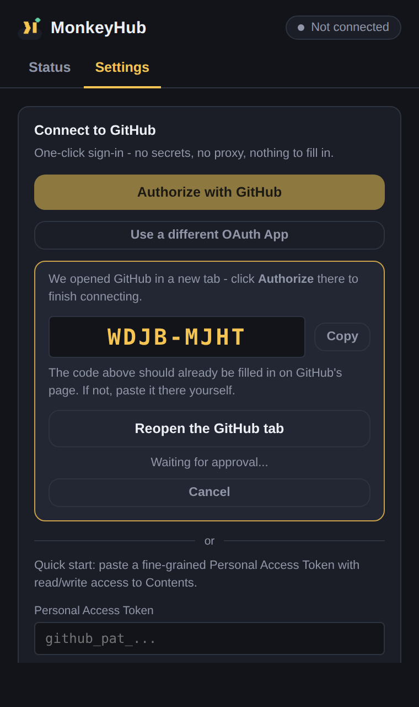

# MonkeyHub

**MonkeyHub** watches [monkeytype.com](https://monkeytype.com) in the background, and every time you finish a typing test it commits the result to a GitHub repository of your choice - keeping a live, profile-style `README.md` up to date with your personal bests, streaks, and an activity calendar, GitHub-contribution-graph style.

No dashboard to check, nothing to click after the first setup: finish a test, watch the commit land - one commit, even if several files changed.

|                              |                              |
| ---------------------------- | ---------------------------- |
|  |  |
|  |  |
|  | |

A real, generated example of the README MonkeyHub pushes to your repo lives at [`docs/sample-generated-README.md`](docs/sample-generated-README.md).

---

## Contents

- [What it does](#what-it-does)
- [How it works](#how-it-works)
- [Install the extension](#install-the-extension)
- [Connect GitHub](#connect-github)
- [Configuration reference](#configuration-reference)
- [Repository layout MonkeyHub creates](#repository-layout-monkeyhub-creates)
- [Edge cases & error handling](#edge-cases--error-handling)
- [Privacy & security](#privacy--security)
- [Troubleshooting](#troubleshooting)
- [Project structure](#project-structure)
- [License](#license)

---

## What it does

- **Captures every completed test automatically.** A content script watches monkeytype.com two ways at once: it sniffs the site's own network traffic for the result it saves to your account (when you're logged in), and it reads the on-screen results panel directly (works even logged out). Whichever arrives first wins; the other is discarded so you never get duplicates.
- **Commits to GitHub in real time - as one commit.** A completed test schedules a sync a few seconds out (so a burst of back-to-back tests lands together), and every changed file - each test-type's data file plus the README - is written in a single atomic commit via the Git Data API. Never one commit per file, never commit spam.
- **Splits your data by test type.** Results are stored as `data/time.json`, `data/words.json`, `data/quote.json`, `data/zen.json`, and `data/custom.json` instead of one growing blob, so history for each mode is easy to diff, script against, or read on its own.
- **Writes a profile-style README.** Overview stats, personal bests per mode (`time 15/30/60/120`, `words 10/25/50/100`, quote, zen, custom), a full year activity calendar, and your 10 most recent tests - regenerated from all data files on every sync.
- **Handles GitHub like a real client should.** Repo-doesn't-exist-yet, rate limits (primary and secondary), non-fast-forward commit races, oversized files, SSO-locked tokens, offline queues - see [Edge cases](#edge-cases--error-handling) for the full list and exactly what MonkeyHub does about each one.
- **One-click GitHub sign-in.** GitHub's device flow - no client secret, no proxy to deploy, no redirect URI to register. A Personal Access Token works too, for an even faster start.
- **Works on Chrome and Firefox** from a single codebase (two thin manifests, everything else shared).

## How it works

```
monkeytype.com
   │
   │  content/page-bridge.js  (injected into the page, sniffs fetch/XHR)
   │  content/content.js      (isolated world, DOM fallback + message bridge)
   ▼
background.js  (MV3 service worker)
   │
   │  lib/stats.js            → personal bests, streaks, activity calendar
   │  lib/readme-generator.js → renders README.md
   │  lib/github-client.js    → GitHub REST + Git Data API, retries, error classification
   │  lib/oauth.js            → GitHub device-flow sign-in
   ▼
GitHub repository            (all files below land in ONE commit per sync)
   data/time.json  data/words.json  data/quote.json  data/zen.json  data/custom.json
   README.md
```

Nothing here talks to a MonkeyHub server, because there isn't one - the only network destination is GitHub itself (`api.github.com` and, only for the sign-in handshake, `github.com`). See [Privacy & security](#privacy--security).

## Install the extension

This repo ships **source** (`src/`) plus a tiny build step that copies it into browser-specific bundles, because Chrome and Firefox still disagree on a couple of manifest keys (service worker vs. background scripts, mainly). You don't need Node or any dependencies to build it - it's a plain file copy.

```bash
./build.sh
```

This produces `dist/chrome/` and `dist/firefox/`, fully self-contained, ready to load. (Pre-built copies of both are also included if you'd rather skip this step.)

### Chrome, Edge, Brave, or any other Chromium browser

1. Go to `chrome://extensions`.
2. Turn on **Developer mode** (top-right toggle).
3. Click **Load unpacked** and select the `dist/chrome` folder.
4. Pin the MonkeyHub icon from the extensions toolbar menu if you'd like it visible at all times.

### Firefox

**Temporary (for trying it out):**
1. Go to `about:debugging#/runtime/this-firefox`.
2. Click **Load Temporary Add-on** and select `dist/firefox/manifest.json`.
3. Temporary add-ons are removed when Firefox restarts - reload it after each restart.

**Permanent:** Firefox requires add-ons distributed outside addons.mozilla.org to be signed. For personal use, package `dist/firefox` and self-distribute via [Firefox's unlisted signing process](https://extensionworkshop.com/documentation/publish/signing-and-distributing-your-add-on/), or run it as a temporary add-on each session.

## Connect GitHub

Open the extension popup → **Settings** (or the full dashboard via **Open dashboard**). Both work identically; the dashboard just has more room.

### Option A - One-click GitHub sign-in (recommended)

This uses GitHub's **device flow**: no client secret, no proxy server, no redirect URI to register. GitHub's OAuth endpoints always require *some* Client ID - that part of the protocol can't be skipped - but it isn't sensitive information the way a client secret is, so it can be baked into the extension itself instead of something you type in.

**If you built MonkeyHub yourself and set `MH.DEFAULT_OAUTH_CLIENT_ID` in `src/lib/constants.js`** (see the comment right above it), there's nothing to configure at all: Settings shows a single **Authorize with GitHub** button, no Client ID box in sight.

**Otherwise** (the default, since this can't ship with one of *my* OAuth Apps baked in - see below):

1. **Create a GitHub OAuth App** - GitHub → Settings → Developer settings → OAuth Apps → **New OAuth App**. Fill in any Homepage URL and any Authorization callback URL (neither is used by the device flow, GitHub just requires the fields to be present). Save, then copy the **Client ID** - the client secret is not needed for this option at all.
2. Paste the **Client ID** into MonkeyHub's Settings once and click **Authorize with GitHub**.

Either way, clicking the button: opens a GitHub tab with a one-time code already filled in, so you just click **Authorize**; MonkeyHub picks up the approval automatically within a few seconds and starts syncing - nothing to copy back into the extension. (If GitHub ever doesn't pre-fill the code for some reason, it's shown in the extension too, ready to paste in.)

> **Why isn't a Client ID just built in already?** It could be, for a specific published build - but a Client ID only works for the exact OAuth App it was issued to, which only exists once someone with a GitHub account registers it. I can't create and maintain one on your behalf from here. If you (or anyone redistributing this extension) register one and set `DEFAULT_OAUTH_CLIENT_ID`, everyone using that build gets the fully zero-setup version.

### Option B - Personal Access Token (fastest, ~30 seconds)

1. On GitHub: **Settings → Developer settings → Personal access tokens → Fine-grained tokens → Generate new token**.
2. Scope it to the repository MonkeyHub will use (or "All repositories" if you'd rather not pick one up front), with **Contents: Read and write** permission.
3. Paste it into MonkeyHub's **Personal Access Token** field and click **Use token**.

The trade-off versus Option A is you're managing the token's lifetime yourself (fine-grained tokens expire after at most a year and need renewing).

## Configuration reference

All of these live in Settings; sensible defaults are pre-filled.

| Setting | Default | Notes |
| --- | --- | --- |
| Owner | your GitHub username | Only needed if syncing to an org or another account you have push access to. |
| Repository name | `monkeytype-stats` | Created automatically if missing (toggle below). |
| Branch | `main` | If MonkeyHub creates the repo, this is adjusted automatically to match whatever GitHub actually initializes (see [Edge cases](#edge-cases--error-handling)). |
| Data folder | `data` | Per-mode files live here: `time.json`, `words.json`, `quote.json`, `zen.json`, `custom.json`. |
| README path | `README.md` | Regenerated in full on every sync. |
| Visibility on create | Public | Only applies the moment MonkeyHub creates the repo for you. |
| Create if missing | On | Off means MonkeyHub will error instead of creating a repo, in case you'd rather do that yourself. |
| Auto-sync | On | Off means results still accumulate locally; sync manually with **Sync now**. |
| Notify on error | On | Native browser notification when a sync fails for a reason retries won't fix. |

## Repository layout MonkeyHub creates

```
your-repo/
├── README.md            ← regenerated every sync, see docs/sample-generated-README.md
└── data/
    ├── time.json        ← every "time" mode result
    ├── words.json       ← every "words" mode result
    ├── quote.json
    ├── zen.json
    └── custom.json
```

A mode file is only created once you've actually completed a test of that type - MonkeyHub doesn't pre-create empty files. Each one looks like:

```json
{
  "version": 1,
  "generatedBy": "MonkeyHub",
  "mode": "time",
  "generatedAt": "2026-09-12T17:56:22.000Z",
  "results": [
    {
      "id": "8f3a1c02",
      "timestamp": 1757692582000,
      "wpm": 121.8,
      "rawWpm": 124,
      "acc": 97.2,
      "consistency": 81.4,
      "mode": "time",
      "mode2": "60",
      "language": "english",
      "punctuation": false,
      "numbers": false,
      "difficulty": "normal",
      "charStats": { "correct": 590, "incorrect": 5, "extra": 0, "missed": 1 },
      "testDuration": 60,
      "source": "network"
    }
  ]
}
```

Every file is plain text - diffable, forkable, scriptable. Nothing about the format is MonkeyHub-proprietary; it's just JSON and Markdown.

## Edge cases & error handling

Every GitHub call goes through a single client (`lib/github-client.js`) that classifies every response and reacts appropriately instead of surfacing a raw HTTP status. Writes go through the **Git Data API** (`MH.gh.commitFiles`) so any number of changed files land as one commit, not one PUT-per-file:

| Status | What it means here | What MonkeyHub does |
| --- | --- | --- |
| **200 / 201** | Success | Updates local sync state (last commit sha, timestamp). |
| **304** | Repo metadata unchanged since MonkeyHub's last check | Treated as a cache hit, not an error. |
| **400** | Malformed request | Surfaced as a MonkeyHub bug report prompt (this should never happen in normal use). |
| **401** | Token invalid or revoked | Prompts reconnection and stops - won't hammer a dead token with retries. |
| **403 (scope)** | Token lacks `repo` scope | Clear message to reconnect with the right scope. |
| **403 (rate limit, `X-RateLimit-Remaining: 0`)** | Primary hourly limit exhausted | Backs off until `X-RateLimit-Reset`, then retries automatically. |
| **403 (secondary rate limit / abuse detection)** | GitHub asked us to slow down | Exponential backoff honoring `Retry-After`. |
| **403 (SSO)** | Org requires SAML SSO-authorized tokens | Explains exactly that, with no generic "forbidden" dead end. |
| **404** (repo) | Repo doesn't exist yet | Creates it (if enabled) via `POST /user/repos` with `auto_init: true`, then adopts whatever default branch GitHub actually assigns. |
| **404** (a data/README file) | First sync ever for that file | Built into the new commit as a brand-new file. |
| **404** (branch ref) | Truly empty repo, no commits yet | Builds the very first commit directly (no base tree/parent) instead of trying to diff against a branch that doesn't exist. |
| **409 / 422** (non-fast-forward) | The branch moved (another device, a manual commit, or an overlapping sync) between MonkeyHub's read and its write | The entire commit sequence - not just the final step - is retried with jittered backoff, up to 5 times, rebuilding on the new branch head each time. |
| **422** (repo creation) | Name already taken / invalid | Clear message to pick another name - never silently renames things behind your back. |
| **429** | Too many requests | Same backoff path as secondary rate limits. |
| **5xx** | GitHub having a bad day | Retried with exponential backoff before giving up. |
| **File > 1MB** | Contents API can't inline it (used for pre-commit reads) | Falls back to the raw media type automatically. |
| Network offline | `fetch` throws | Result stays safely in local storage (which *is* the durable queue - nothing is lost) and a periodic `chrome.alarms` retry picks it up once you're back online. |

Two design choices worth calling out:

- **The local results store is the queue.** A captured test is written to `chrome.storage.local` the instant it's captured, before any network call happens. A failed sync never loses data - it just means GitHub hasn't caught up yet.
- **Merges are by-id, never overwrite.** Before committing, MonkeyHub reads each mode file fresh and merges by result id - no cached sha or etag is ever reused across syncs, so a token swap, a second device, or a manual edit on GitHub can never collide with stale local state.
- **The sync lock survives service-worker restarts.** MV3 can recycle the background worker mid-sync, which would otherwise let a second trigger start an overlapping write. MonkeyHub persists a lock timestamp to storage (not just an in-memory flag) so a fresh worker instance can tell a genuinely-still-running sync (skip it) apart from one that died silently (proceed after ~45 seconds).

## Privacy & security

- MonkeyHub only ever talks to GitHub - `api.github.com` for everything, plus `github.com` for the two device-flow sign-in requests. There is no MonkeyHub server.
- Your typing data goes to **your** GitHub repository - public or private, your choice. MonkeyHub collects nothing.
- Tokens are stored in `chrome.storage.local`, which is sandboxed to the extension and not synced to Google/Mozilla's cloud (deliberately using `.local`, not `.sync`).
- Nothing about GitHub sign-in requires a client secret: the device flow (Option A) never uses one, and a Personal Access Token (Option B) is just a token you generate and can revoke yourself at any time from GitHub's settings.
- The Firefox build declares `data_collection_permissions: { required: ["none"] }` - accurate, since MonkeyHub doesn't transmit anything to a developer-controlled destination.

## Troubleshooting

**Tests aren't being captured.** Open the browser console on monkeytype.com and run `window.__monkeyHubDebug = true`, then complete another test - `content/content.js` logs every extraction attempt (network candidate received, DOM scrape result, or why it aborted). Monkeytype occasionally redesigns its results screen; if the DOM scrape stops finding `wpm`/`acc`, update the selectors in the `SELECTORS` object near the top of `content/content.js` - everything downstream keeps working unchanged.

**"Connect with GitHub" doesn't do anything.** Make sure a Client ID is filled in first - MonkeyHub needs it to request a device code. If GitHub returns an error immediately, double-check the OAuth App still exists and hasn't been deleted or suspended.

**The device code expired before I entered it.** Codes are valid for about 15 minutes. Click **Cancel**, then **Connect with GitHub** again for a fresh code.

**Sync says "connected" but nothing shows up on GitHub.** Check Settings → the repository owner/name are correct, and open the dashboard's **Sync activity** panel - every attempt, success or failure, is logged there with the exact reason.

**I changed my token and now sync fails.** This should self-heal automatically - MonkeyHub always reads each data file fresh right before committing rather than trusting a cached version. If you still see an error, open **Sync activity** for the exact GitHub error and check that the new token has write access to the target repository.

## Project structure

```
monkeyhub/
├── build.sh                     # assembles dist/chrome and dist/firefox from src/
├── src/
│   ├── manifest.chrome.json
│   ├── manifest.firefox.json
│   ├── background.js            # service worker: debounced sync engine + message router
│   ├── content/
│   │   ├── content.js           # isolated world: DOM fallback, message bridge
│   │   └── page-bridge.js       # injected into the page: network sniffing
│   ├── lib/
│   │   ├── constants.js
│   │   ├── browser-api.js       # chrome/browser namespace + promise shim
│   │   ├── util.js              # base64, hashing, dates, formatting
│   │   ├── oauth.js             # GitHub device-flow sign-in
│   │   ├── storage.js
│   │   ├── github-client.js     # REST + Git Data API client, retries, error classification
│   │   ├── stats.js             # personal bests, streaks, activity calendar, mode grouping
│   │   └── readme-generator.js
│   ├── popup/                   # toolbar popup (status + settings)
│   ├── dashboard/                # full-page dashboard (also the Options page)
│   └── icons/
├── docs/
│   ├── screenshots/
│   └── sample-generated-README.md
├── tools/                        # dev-only: screenshot & live-extension validation scripts (need Python + Playwright)
└── dist/                         # build output (chrome/, firefox/)
```

## License

MIT - see [`LICENSE`](LICENSE).

---

<sub>Dev note: `tools/screenshot.py` and `tools/validate_extension.py` (both need Python + `pip install playwright && playwright install chromium`) are what produced the screenshots above and what was used to load the actual built extension in a real browser to check for console/service-worker errors before shipping. Neither is needed to use MonkeyHub - they're just how this was verified.</sub>
